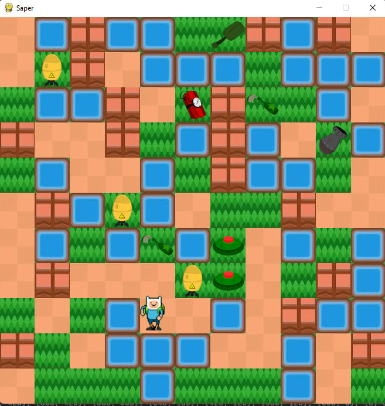

# PySaper: AI-Powered Minesweeper



PySaper is a Minesweeper game developed in Pygame, featuring advanced AI techniques for decision-making, bomb detection, optimal bomb picking, and pathfinding. This project combines classic gameplay with cutting-edge AI functionalities to enhance the player experience.

## Features

- **Decision Tree:** Implementing a decision tree for strategic decision-making, enabling the AI to choose between taking a bomb, exploding, or dropping taken bombs at the start.
- **Neural Network Bomb Detection:** Utilizing a trained neural network to detect bombs within images for accurate identification of hazardous areas.
- **Genetic Algorithm:** Employing a genetic algorithm to select the most optimal sequence for picking bombs, maximizing efficiency and minimizing risk.
- **A\* Pathfinding Algorithm:** Utilizing the A* algorithm to find the most efficient paths on the grid, aiding in navigation and decision-making during exploration.

## Requirements

- Python >= 3.9
- Pygame (install using the requirements file)

## Installation

1. Clone the repository.
2. Install dependencies from the `requirements.txt` file:
```bash
pip install -r requirements.txt
```


## Usage
Run the game using Python:
```bash
python main.py
```
